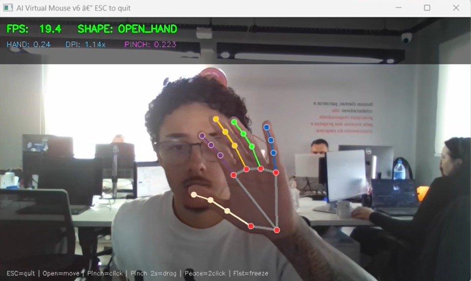

<p align="center">
  
</p>

<p align="center">
  <a href="https://git.io/typing-svg">
    
  </a>
</p>

<p align="center">
  <a href="https://www.linkedin.com/in/guilherme-moraes-franco-b4b1a0353/">
    
  </a>&nbsp;
  <a href="https://blogpessoalgui.netlify.app/">
    
  </a>&nbsp;
  <a href="mailto:og.guifranco@gmail.com">
    
  </a>&nbsp;
  
</p>

---

## About

```yaml
name:      Guilherme Moraes Franco
role:      IT Infrastructure & Cloud — IT Universe
education: Computer Science — UNIP (2025–)
location:  São Paulo, BR
focus:     Generative AI · Cloud Architecture · AWS · DevOps
```

I design and deploy cloud-native infrastructure on **AWS**, build **AI-powered agents** that automate real-world workflows, and apply **DevOps** practices to ship faster with confidence. My current work sits at the intersection of **Generative AI** and **Cloud Engineering** — using LLMs not just as chatbots, but as autonomous systems that execute tasks, manage infrastructure, and solve operational problems end-to-end.


---

## Stack

<table>
  <tr>
    <td align="center" width="33%"><b>☁️ Cloud & Infra</b></td>
    <td align="center" width="33%"><b>💻 Languages</b></td>
    <td align="center" width="33%"><b>⚙️ Tools</b></td>
  </tr>
  <tr>
    <td align="center">
      &nbsp;&nbsp;&nbsp;
      &nbsp;&nbsp;&nbsp;
      
    </td>
    <td align="center">
      &nbsp;&nbsp;&nbsp;
      &nbsp;&nbsp;&nbsp;
      &nbsp;&nbsp;&nbsp;
      
    </td>
    <td align="center">
      &nbsp;&nbsp;&nbsp;
      &nbsp;&nbsp;&nbsp;
      
    </td>
  </tr>
</table>

---

## Projects

<table>
  <tr>
    <td width="50%">
      <h3 align="center">🤖 <a href="https://github.com/ognistie/AI-Farm-Agent">AI Farm Agent</a></h3>
      <p align="center">
        Multi-agent system that executes real tasks on a local machine via natural language. Hierarchical architecture with specialized agents — Maestro, Web, Code, Desktop, Vision — powered by Claude models.
      </p>
      <p align="center">
        
        
        
        
        
      </p>
    </td>
    <td width="50%">
      <h3 align="center">🚀 <a href="https://github.com/ognistie/CloudOps-copilot">CloudOps Copilot</a></h3>
      <p align="center">
        Web-based copilot for cloud operations automation. Generates deploy plans, security checklists, and troubleshooting guides. Deployed on AWS EC2 with Nginx and systemd.
      </p>
      <p align="center">
        
        
        
        
      </p>
    </td>
  </tr>
  <tr>
    <td width="50%" colspan="2">
      <h3 align="center">🛹 <a href="https://github.com/ognistie/SkateRoom">SkateRoom</a></h3>
      <p align="center">
        Watch party platform with procedurally generated SVG characters. Deployed on AWS EC2 with Nginx, PM2, and Docker.
      </p>
      <p align="center">
        
        
        
        
      </p>
    </td>
  </tr>
</table>

---

## AI Virtual Mouse

<p align="center">
  <a href="https://www.linkedin.com/feed/update/urn:li:activity:7453110643710255104/">
    
  </a>
</p>

<p align="center">
  <a href="https://www.linkedin.com/feed/update/urn:li:activity:7453110643710255104/">
    ▶ Watch on LinkedIn
  </a>
</p>

---

## GitHub Stats

<div align="center">

<a href="https://github.com/ognistie">
  
</a>
<a href="https://github.com/ognistie">
  
</a>

<br/>

<a href="https://github.com/ognistie">
  
</a>

<br/>

<a href="https://github.com/ognistie">
  
</a>

</div>

---

<p align="center"><b>Automate everything. Ship with confidence. 🚀</b></p>
